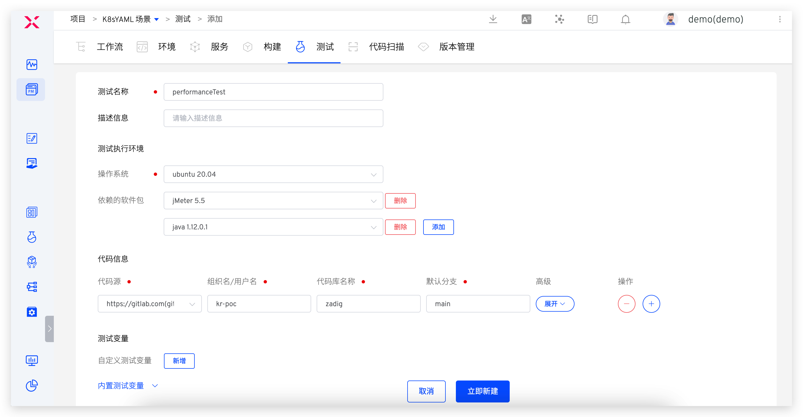
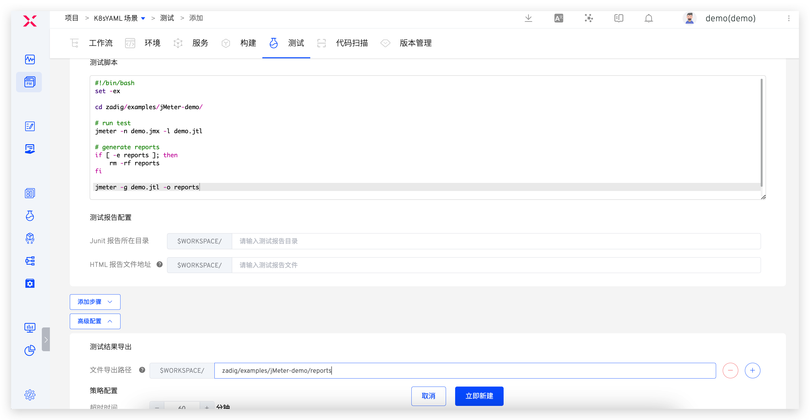
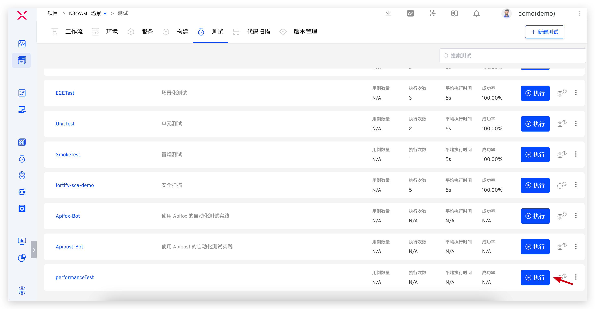
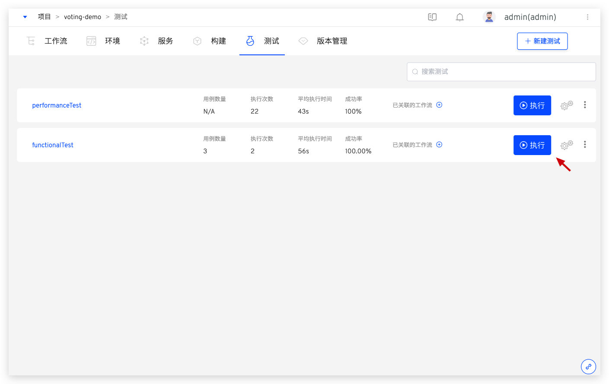
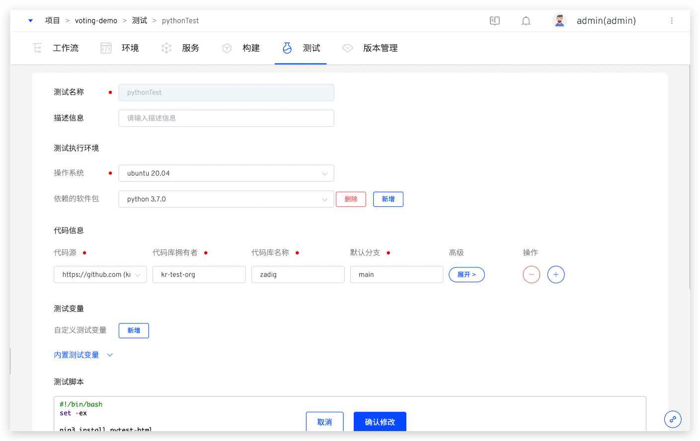
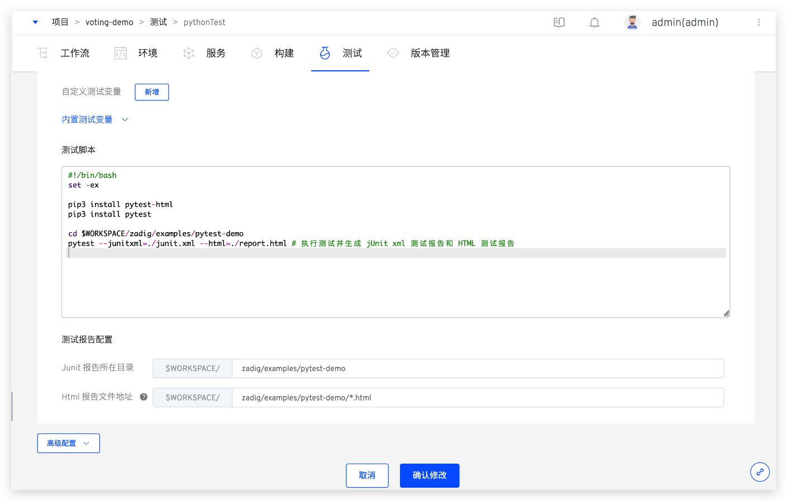
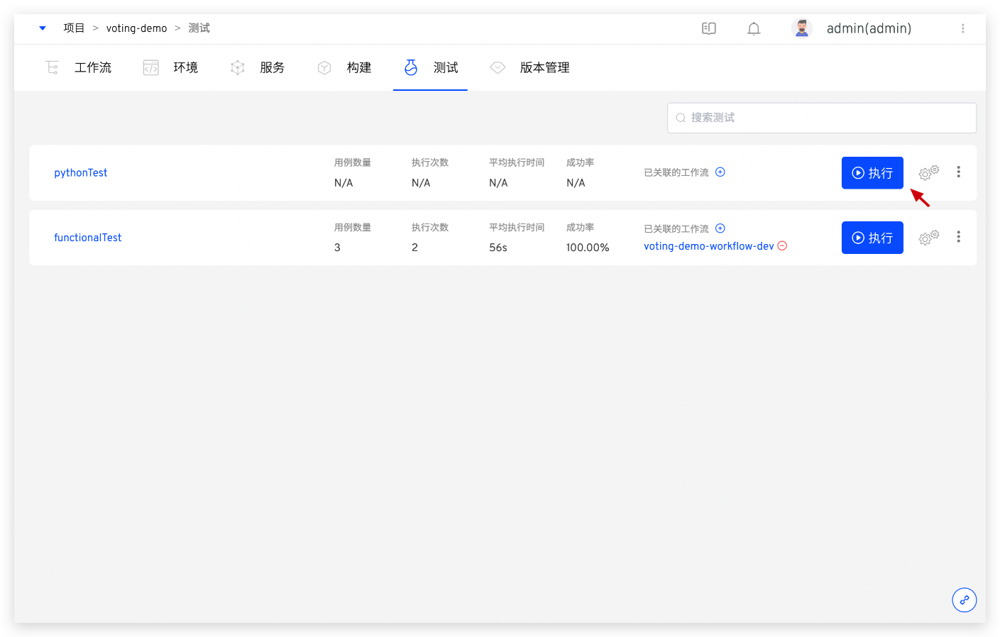
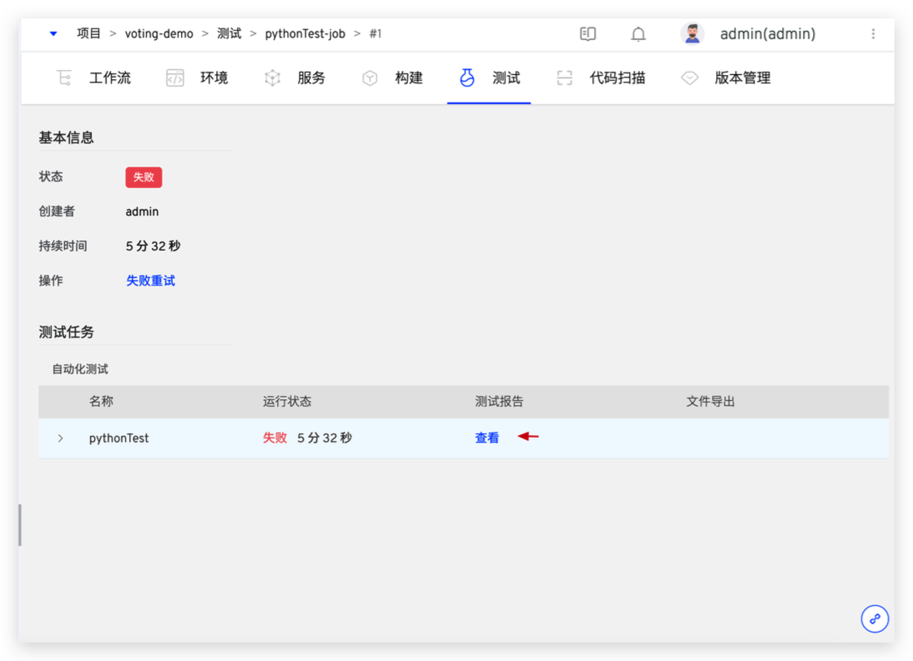
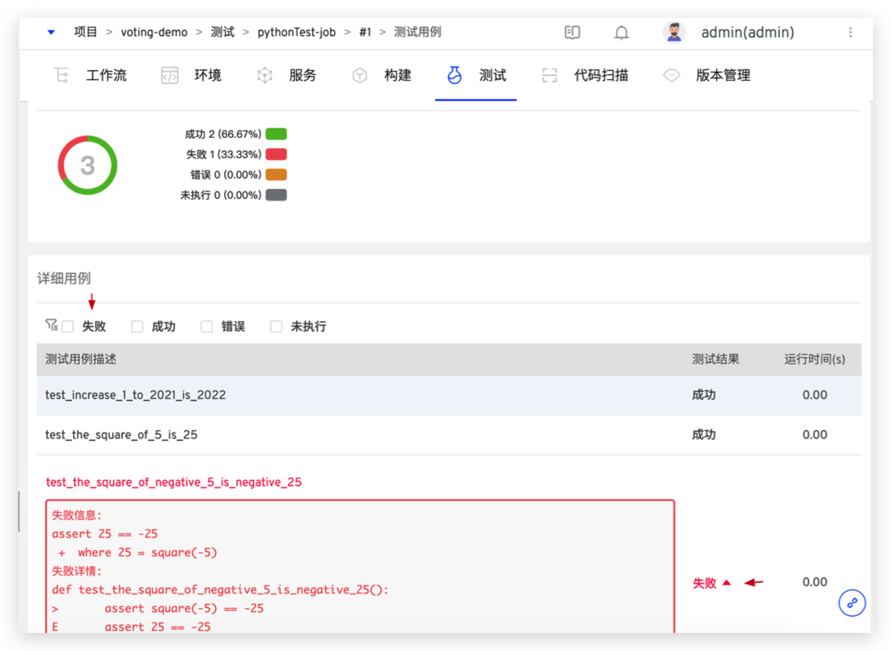

Zadig 几乎支持市面上所有测试工具和框架，下面介绍几种主流测试框架在 Zadig 中的应用实践，包括自动化测试用例的管理、自动化测试的执行，测试报告的分析等，并结合 Zadig 的环境能力实现测试左移，赋能其他角色也参与到质量建设中来，有效降低问题发现和修复成本。

## 测试框架/工具

### JMeter

> 关于 JMeter 的更多信息可点击[链接](https://github.com/apache/jmeter)查看。

#### 组织自动化测试代码

根据实际测试业务和功能，编写自动化测试代码并组织在代码仓库中。本实践中将使用 JMeter 对 KodeRover 官网进行一个简单的压测，自动化测试源码可点击[链接](https://github.com/koderover/zadig/tree/main/examples/jMeter-demo)查看。

#### 配置自动化测试




进入 Zadig 的具体项目，完成自动化测试的配置，说明如下：
- 配置测试执行环境：选择执行自动化测试时所必须的软件包，本例中依赖的软件包分别为 `jMeter 5.4.3` 和 `java 1.12.0.1`。如果系统内置的软件包种类或版本无法满足测试需求，也可以参考[软件包配置](/Zadig%20v2.2.0/settings/app/)新增软件包
- 配置代码信息：配置执行自动化测试所必须的相关代码库，包括但不限于：
    - 自动化测试用例源码所在的代码仓库
    - 执行自动化测试依赖的相关基础组件库
- 配置测试脚本：配置运行自动化测试的脚本，本例中测试脚本如下：
``` bash
#!/bin/bash
set -ex
cd zadig/examples/jMeter-demo/
jmeter -n -t demo.jmx -l demo.jtl # run test
if [ -e reports ]; then
    rm -rf reports
fi
jmeter -g demo.jtl -o reports # generate reports
```
- 高级配置：配置测试结果导出以便在测试执行完毕后下载测试报告进行分析。填写测试报告目录，本例中为 `$WORKSPACE/zadig/examples/jMeter-demo/reports`

#### 执行自动化测试

配置完毕后，执行自动化测试。



#### 分析测试报告

暂不支持在平台直接浏览测试报告，待自动化测试运行完毕后，点击`下载`将测试报告下载到本地。


解读下载的测试报告，查看本次压力测试的结果，分析性能瓶颈。


### Ginkgo

> 关于 Ginkgo 的更多信息可点击[链接](https://github.com/onsi/ginkgo)查看。

#### 组织自动化测试代码

根据实际测试业务和功能，编写自动化测试代码并组织在代码仓库中。本实践中将对 KodeRover 官网及文档站的可用性进行自动化检测，自动化测试源码可点击[链接](https://github.com/koderover/zadig/tree/main/examples/test-demo/test)查看。

#### 配置自动化测试


进入 Zadig 的具体项目，完成自动化测试的配置，说明如下：
- 配置测试执行环境：选择执行自动化测试时所必须的软件包：
    -  `go 1.16.13`
    -  `ginkgo 2.0.0`
- 配置代码信息：配置执行自动化测试所必须的相关代码库，包括但不限于：
    - 自动化测试用例源码所在的代码仓库
    - 执行自动化测试依赖的相关基础组件库
- 配置测试脚本：配置运行自动化测试的脚本，本例中测试脚本如下：

``` bash
#!/bin/bash
set -ex
export GOPROXY=https://goproxy.cn,direct
go mod tidy
cd zadig/examples/test-demo/test
ginkgo -v --junit-report=out.xml # 运行测试用例并产出 Junit XML 格式的测试报告
```

- 测试报告配置：配置 Junit XML 格式的测试报告目录，本例中为 `$WORKSPACE/zadig/examples/test-demo/test`

#### 执行自动化测试

配置完毕后，执行自动化测试。



#### 分析测试报告

待自动化测试运行完毕后点击查看测试报告，可查看每一条用例的执行详情，快速过滤失败的用例重点分析。


### Pytest
> 关于 Pytest 的更多信息可点击[链接](https://github.com/pytest-dev/pytest)查看。

#### 组织自动化测试代码

根据实际测试业务和功能，编写自动化测试代码并组织在代码仓库中。本实践中将使用 Pytest 进行数学运算测试，自动化测试源码可点击[链接](https://github.com/koderover/zadig/tree/main/examples/pytest-demo/)查看。

#### 配置自动化测试




进入 Zadig 的具体项目，完成自动化测试的配置，说明如下：
- 配置测试执行环境：选择执行自动化测试时所必须的软件包，本例中对 Python 的版本有要求，可配置 `Python 3.7.0`，软件包管理可参考：[软件包配置](/Zadig%20v2.2.0/settings/app/)
- 配置代码信息：配置执行自动化测试所必须的相关代码库，包括但不限于：
    - 自动化测试用例源码所在的代码仓库
    - 执行自动化测试依赖的相关基础组件库
- 配置测试脚本：配置运行自动化测试的脚本，本例中测试脚本如下：
``` bash
#!/bin/bash
set -ex
pip3 install pytest-html
pip3 install pytest
cd $WORKSPACE/zadig/examples/pytest-demo
pytest --junitxml=./junit.xml --html=./report.html # 执行测试并生成 JUnit xml 测试报告和 Html 测试报告
```
- 测试报告配置：按需配置 JUnit xml 格式和 Html 格式的测试报告。
    - Junit 报告：本例中为 `$WORKSPACE/zadig/examples/pytest-demo`
    - Html 报告：本例中为 `$WORKSPACE/zadig/examples/pytest-demo/*.html`

#### 执行自动化测试

配置完毕后，执行自动化测试。



#### 分析测试报告

待自动化测试运行完毕后点击查看测试报告，可查看每一条用例的执行详情，快速过滤失败的用例重点分析。




<!-- ## 进阶使用

有了自动化测试后，在 Zadig 上如何使用才能最大程度的发挥其价值，切切实实地为日常业务迭代中提供质量保障，下面我们展开介绍。

### 和环境联动

将自动化测试和工作流关联起来，当日常运行工作流更新环境后，会自动执行自动化测试。可以实现只要环境有变更，就第一时间对其做自动化测试。


 -->

<!-- ### 质量保证前置
TODO：配置 Webhook 和通知，一旦提交变更就自动触发部署服务和执行自动化测试，并第一时间反馈结果到 IM -->

<!-- ## TODO 接入自建测试平台

已有的测试平台如何接入 Zadig -->
